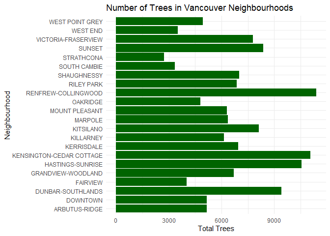
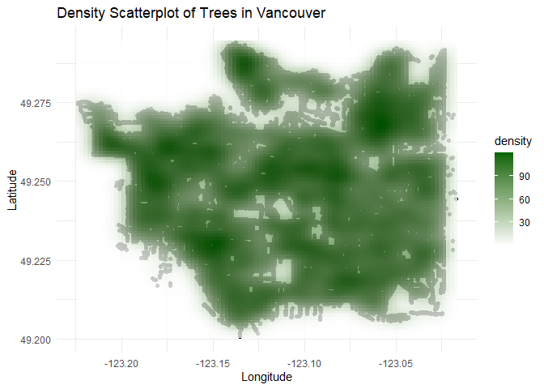

# Welcome to your (maybe) first-ever data analysis project!

And hopefully the first of many. Let’s get started:

1.  Install the [`datateachr`](https://github.com/UBC-MDS/datateachr)
    package by typing the following into your **R terminal**:

<!-- -->

    install.packages("devtools")
    devtools::install_github("UBC-MDS/datateachr")

1.  Load the packages below.

<!-- -->

    library(datateachr)
    library(tidyverse)

    ## ── Attaching core tidyverse packages ──────────────────────── tidyverse 2.0.0 ──
    ## ✔ dplyr     1.1.3     ✔ readr     2.1.4
    ## ✔ forcats   1.0.0     ✔ stringr   1.5.0
    ## ✔ ggplot2   3.4.3     ✔ tibble    3.2.1
    ## ✔ lubridate 1.9.2     ✔ tidyr     1.3.0
    ## ✔ purrr     1.0.2     
    ## ── Conflicts ────────────────────────────────────────── tidyverse_conflicts() ──
    ## ✖ dplyr::filter() masks stats::filter()
    ## ✖ dplyr::lag()    masks stats::lag()
    ## ℹ Use the conflicted package (<http://conflicted.r-lib.org/>) to force all conflicts to become errors

    library(ggplot2)

1.  Make a repository in the <https://github.com/stat545ubc-2023>
    Organization. You can do this by following the steps found on canvas
    in the entry called [MDA: Create a
    repository](https://canvas.ubc.ca/courses/126199/pages/mda-create-a-repository).
    One completed, your repository should automatically be listed as
    part of the stat545ubc-2023 Organization.

# Instructions

## For Both Milestones

-   Each milestone has explicit tasks. Tasks that are more challenging
    will often be allocated more points.

-   Each milestone will be also graded for reproducibility, cleanliness,
    and coherence of the overall Github submission.

-   While the two milestones will be submitted as independent
    deliverables, the analysis itself is a continuum - think of it as
    two chapters to a story. Each chapter, or in this case, portion of
    your analysis, should be easily followed through by someone
    unfamiliar with the content.
    [Here](https://swcarpentry.github.io/r-novice-inflammation/06-best-practices-R/)
    is a good resource for what constitutes “good code”. Learning good
    coding practices early in your career will save you hassle later on!

-   The milestones will be equally weighted.

## For Milestone 1

**To complete this milestone**, edit [this very `.Rmd`
file](https://raw.githubusercontent.com/UBC-STAT/stat545.stat.ubc.ca/master/content/mini-project/mini-project-1.Rmd)
directly. Fill in the sections that are tagged with
`<!--- start your work below --->`.

**To submit this milestone**, make sure to knit this `.Rmd` file to an
`.md` file by changing the YAML output settings from
`output: html_document` to `output: github_document`. Commit and push
all of your work to the mini-analysis GitHub repository you made
earlier, and tag a release on GitHub. Then, submit a link to your tagged
release on canvas.

**Points**: This milestone is worth 36 points: 30 for your analysis, and
6 for overall reproducibility, cleanliness, and coherence of the Github
submission.

# Learning Objectives

By the end of this milestone, you should:

-   Become familiar with your dataset of choosing
-   Select 4 questions that you would like to answer with your data
-   Generate a reproducible and clear report using R Markdown
-   Become familiar with manipulating and summarizing your data in
    tibbles using `dplyr`, with a research question in mind.

# Task 1: Choose your favorite dataset

The `datateachr` package by Hayley Boyce and Jordan Bourak currently
composed of 7 semi-tidy datasets for educational purposes. Here is a
brief description of each dataset:

-   *apt\_buildings*: Acquired courtesy of The City of Toronto’s Open
    Data Portal. It currently has 3455 rows and 37 columns.

-   *building\_permits*: Acquired courtesy of The City of Vancouver’s
    Open Data Portal. It currently has 20680 rows and 14 columns.

-   *cancer\_sample*: Acquired courtesy of UCI Machine Learning
    Repository. It currently has 569 rows and 32 columns.

-   *flow\_sample*: Acquired courtesy of The Government of Canada’s
    Historical Hydrometric Database. It currently has 218 rows and 7
    columns.

-   *parking\_meters*: Acquired courtesy of The City of Vancouver’s Open
    Data Portal. It currently has 10032 rows and 22 columns.

-   *steam\_games*: Acquired courtesy of Kaggle. It currently has 40833
    rows and 21 columns.

-   *vancouver\_trees*: Acquired courtesy of The City of Vancouver’s
    Open Data Portal. It currently has 146611 rows and 20 columns.

**Things to keep in mind**

-   We hope that this project will serve as practice for carrying our
    your own *independent* data analysis. Remember to comment your code,
    be explicit about what you are doing, and write notes in this
    markdown document when you feel that context is required. As you
    advance in the project, prompts and hints to do this will be
    diminished - it’ll be up to you!

-   Before choosing a dataset, you should always keep in mind **your
    goal**, or in other ways, *what you wish to achieve with this data*.
    This mini data-analysis project focuses on *data wrangling*,
    *tidying*, and *visualization*. In short, it’s a way for you to get
    your feet wet with exploring data on your own.

And that is exactly the first thing that you will do!

1.1 **(1 point)** Out of the 7 datasets available in the `datateachr`
package, choose **4** that appeal to you based on their description.
Write your choices below:

**Note**: We encourage you to use the ones in the `datateachr` package,
but if you have a dataset that you’d really like to use, you can include
it here. But, please check with a member of the teaching team to see
whether the dataset is of appropriate complexity. Also, include a
**brief** description of the dataset here to help the teaching team
understand your data.

<!-------------------------- Start your work below ---------------------------->

### First Choice

**My first choice is the vancouver\_trees data set because I am curious
about the species native to this city.**

### Second Choice

**My second choice is the cancer\_sample data set because I want to
leverage my lifescience background to make sense of the data.**

### Third Choice

**My third choice is the parking\_meters data set because with the
recent installation of new meters in my neighborhood, I want to see if
there is an increase in revenue for the government.**

### Fourth Choice

**My fourth choice is the steam\_games data set because I want to learn
more about the category of videogames that perform well in the most
current 5 years.**

<!----------------------------------------------------------------------------->

1.2 **(6 points)** One way to narrowing down your selection is to
*explore* the datasets. Use your knowledge of dplyr to find out at least
*3* attributes about each of these datasets (an attribute is something
such as number of rows, variables, class type…). The goal here is to
have an idea of *what the data looks like*.

*Hint:* This is one of those times when you should think about the
cleanliness of your analysis. I added a single code chunk for you below,
but do you want to use more than one? Would you like to write more
comments outside of the code chunk?

<!-------------------------- Start your work below ---------------------------->

### Code Chunk for “vancouver\_trees” data set

**I will use “glimpse”, “summarize”, “group\_by” and “arrange”**

    ### EXPLORE HERE ###

    #column_names <- colnames(vancouver_trees)

    #print(column_names)

    vancouver_trees

    ## # A tibble: 146,611 × 20
    ##    tree_id civic_number std_street    genus_name species_name cultivar_name  
    ##      <dbl>        <dbl> <chr>         <chr>      <chr>        <chr>          
    ##  1  149556          494 W 58TH AV     ULMUS      AMERICANA    BRANDON        
    ##  2  149563          450 W 58TH AV     ZELKOVA    SERRATA      <NA>           
    ##  3  149579         4994 WINDSOR ST    STYRAX     JAPONICA     <NA>           
    ##  4  149590          858 E 39TH AV     FRAXINUS   AMERICANA    AUTUMN APPLAUSE
    ##  5  149604         5032 WINDSOR ST    ACER       CAMPESTRE    <NA>           
    ##  6  149616          585 W 61ST AV     PYRUS      CALLERYANA   CHANTICLEER    
    ##  7  149617         4909 SHERBROOKE ST ACER       PLATANOIDES  COLUMNARE      
    ##  8  149618         4925 SHERBROOKE ST ACER       PLATANOIDES  COLUMNARE      
    ##  9  149619         4969 SHERBROOKE ST ACER       PLATANOIDES  COLUMNARE      
    ## 10  149625          720 E 39TH AV     FRAXINUS   AMERICANA    AUTUMN APPLAUSE
    ## # ℹ 146,601 more rows
    ## # ℹ 14 more variables: common_name <chr>, assigned <chr>, root_barrier <chr>,
    ## #   plant_area <chr>, on_street_block <dbl>, on_street <chr>,
    ## #   neighbourhood_name <chr>, street_side_name <chr>, height_range_id <dbl>,
    ## #   diameter <dbl>, curb <chr>, date_planted <date>, longitude <dbl>,
    ## #   latitude <dbl>

    glimpse(vancouver_trees)

    ## Rows: 146,611
    ## Columns: 20
    ## $ tree_id            <dbl> 149556, 149563, 149579, 149590, 149604, 149616, 149…
    ## $ civic_number       <dbl> 494, 450, 4994, 858, 5032, 585, 4909, 4925, 4969, 7…
    ## $ std_street         <chr> "W 58TH AV", "W 58TH AV", "WINDSOR ST", "E 39TH AV"…
    ## $ genus_name         <chr> "ULMUS", "ZELKOVA", "STYRAX", "FRAXINUS", "ACER", "…
    ## $ species_name       <chr> "AMERICANA", "SERRATA", "JAPONICA", "AMERICANA", "C…
    ## $ cultivar_name      <chr> "BRANDON", NA, NA, "AUTUMN APPLAUSE", NA, "CHANTICL…
    ## $ common_name        <chr> "BRANDON ELM", "JAPANESE ZELKOVA", "JAPANESE SNOWBE…
    ## $ assigned           <chr> "N", "N", "N", "Y", "N", "N", "N", "N", "N", "N", "…
    ## $ root_barrier       <chr> "N", "N", "N", "N", "N", "N", "N", "N", "N", "N", "…
    ## $ plant_area         <chr> "N", "N", "4", "4", "4", "B", "6", "6", "3", "3", "…
    ## $ on_street_block    <dbl> 400, 400, 4900, 800, 5000, 500, 4900, 4900, 4900, 7…
    ## $ on_street          <chr> "W 58TH AV", "W 58TH AV", "WINDSOR ST", "E 39TH AV"…
    ## $ neighbourhood_name <chr> "MARPOLE", "MARPOLE", "KENSINGTON-CEDAR COTTAGE", "…
    ## $ street_side_name   <chr> "EVEN", "EVEN", "EVEN", "EVEN", "EVEN", "ODD", "ODD…
    ## $ height_range_id    <dbl> 2, 4, 3, 4, 2, 2, 3, 3, 2, 2, 2, 5, 3, 2, 2, 2, 2, …
    ## $ diameter           <dbl> 10.00, 10.00, 4.00, 18.00, 9.00, 5.00, 15.00, 14.00…
    ## $ curb               <chr> "N", "N", "Y", "Y", "Y", "Y", "Y", "Y", "Y", "Y", "…
    ## $ date_planted       <date> 1999-01-13, 1996-05-31, 1993-11-22, 1996-04-29, 19…
    ## $ longitude          <dbl> -123.1161, -123.1147, -123.0846, -123.0870, -123.08…
    ## $ latitude           <dbl> 49.21776, 49.21776, 49.23938, 49.23469, 49.23894, 4…

    vancouver_trees %>% group_by(species_name) %>%
      summarise(count = n()) %>%
      arrange(desc(count))

    ## # A tibble: 283 × 2
    ##    species_name count
    ##    <chr>        <int>
    ##  1 SERRULATA    13357
    ##  2 CERASIFERA   12031
    ##  3 PLATANOIDES  11963
    ##  4 RUBRUM        8467
    ##  5 AMERICANA     5515
    ##  6 SYLVATICA     5285
    ##  7 BETULUS       5195
    ##  8 EUCHLORA   X  4427
    ##  9 FREEMANI   X  4164
    ## 10 CAMPESTRE     3477
    ## # ℹ 273 more rows

### Code Chunk for “cancer\_sample” data set

**I will use “filter”, “distinct”, and “rename”**

    largeradius_data <- filter(cancer_sample, radius_mean >= 25)

    print(largeradius_data)

    ## # A tibble: 5 × 32
    ##          ID diagnosis radius_mean texture_mean perimeter_mean area_mean
    ##       <dbl> <chr>           <dbl>        <dbl>          <dbl>     <dbl>
    ## 1   8611555 M                25.2         24.9           172.      1878
    ## 2    873592 M                27.2         21.9           182.      2250
    ## 3   8810703 M                28.1         18.5           188.      2499
    ## 4    899987 M                25.7         17.5           174.      2010
    ## 5 911296202 M                27.4         26.3           187.      2501
    ## # ℹ 26 more variables: smoothness_mean <dbl>, compactness_mean <dbl>,
    ## #   concavity_mean <dbl>, concave_points_mean <dbl>, symmetry_mean <dbl>,
    ## #   fractal_dimension_mean <dbl>, radius_se <dbl>, texture_se <dbl>,
    ## #   perimeter_se <dbl>, area_se <dbl>, smoothness_se <dbl>,
    ## #   compactness_se <dbl>, concavity_se <dbl>, concave_points_se <dbl>,
    ## #   symmetry_se <dbl>, fractal_dimension_se <dbl>, radius_worst <dbl>,
    ## #   texture_worst <dbl>, perimeter_worst <dbl>, area_worst <dbl>, …

    distinctradius_rows <- cancer_sample %>%
      distinct(radius_worst)

    print(distinctradius_rows)

    ## # A tibble: 457 × 1
    ##    radius_worst
    ##           <dbl>
    ##  1         25.4
    ##  2         25.0
    ##  3         23.6
    ##  4         14.9
    ##  5         22.5
    ##  6         15.5
    ##  7         22.9
    ##  8         17.1
    ##  9         15.5
    ## 10         15.1
    ## # ℹ 447 more rows

    cancer_sample1 <- cancer_sample %>%
      rename(worst_radius = radius_worst)

### Code Chunk for “parking\_meters” data set

**I will use “glimpse”, “select”, and “mutate”**

    parking_meters %>% select(r_mf_9a_6p)

    ## # A tibble: 10,032 × 1
    ##    r_mf_9a_6p
    ##    <chr>     
    ##  1 $2.00     
    ##  2 $1.00     
    ##  3 $1.00     
    ##  4 $1.00     
    ##  5 $2.00     
    ##  6 $2.00     
    ##  7 $2.00     
    ##  8 $2.00     
    ##  9 $4.00     
    ## 10 $2.00     
    ## # ℹ 10,022 more rows

    new_data <- data.frame(
      meter_head = c("Single", "Twin"))

    print(new_data)

    ##   meter_head
    ## 1     Single
    ## 2       Twin

    glimpse(parking_meters)

    ## Rows: 10,032
    ## Columns: 22
    ## $ meter_head     <chr> "Twin", "Pay Station", "Twin", "Single", "Twin", "Twin"…
    ## $ r_mf_9a_6p     <chr> "$2.00", "$1.00", "$1.00", "$1.00", "$2.00", "$2.00", "…
    ## $ r_mf_6p_10     <chr> "$4.00", "$1.00", "$1.00", "$1.00", "$1.00", "$1.00", "…
    ## $ r_sa_9a_6p     <chr> "$2.00", "$1.00", "$1.00", "$1.00", "$2.00", "$2.00", "…
    ## $ r_sa_6p_10     <chr> "$4.00", "$1.00", "$1.00", "$1.00", "$1.00", "$1.00", "…
    ## $ r_su_9a_6p     <chr> "$2.00", "$1.00", "$1.00", "$1.00", "$2.00", "$2.00", "…
    ## $ r_su_6p_10     <chr> "$4.00", "$1.00", "$1.00", "$1.00", "$1.00", "$1.00", "…
    ## $ rate_misc      <chr> NA, "$ .50", NA, NA, NA, NA, NA, NA, NA, NA, NA, NA, NA…
    ## $ time_in_effect <chr> "METER IN EFFECT: 9:00 AM TO 10:00 PM", "METER IN EFFEC…
    ## $ t_mf_9a_6p     <chr> "2 Hr", "10 Hrs", "2 Hr", "2 Hr", "2 Hr", "3 Hr", "2 Hr…
    ## $ t_mf_6p_10     <chr> "4 Hr", "10 Hrs", "4 Hr", "4 Hr", "4 Hr", "4 Hr", "4 Hr…
    ## $ t_sa_9a_6p     <chr> "2 Hr", "10 Hrs", "2 Hr", "2 Hr", "2 Hr", "3 Hr", "2 Hr…
    ## $ t_sa_6p_10     <chr> "4 Hr", "10 Hrs", "4 Hr", "4 Hr", "4 Hr", "4 Hr", "4 Hr…
    ## $ t_su_9a_6p     <chr> "2 Hr", "10 Hrs", "2 Hr", "2 Hr", "2 Hr", "3 Hr", "2 Hr…
    ## $ t_su_6p_10     <chr> "4 Hr", "10 Hrs", "4 Hr", "4 Hr", "4 Hr", "4 Hr", "4 Hr…
    ## $ time_misc      <chr> NA, "No Time Limit", NA, NA, NA, NA, NA, NA, NA, NA, NA…
    ## $ credit_card    <chr> "No", "Yes", "No", "No", "No", "No", "No", "No", "No", …
    ## $ pay_phone      <chr> "66890", "59916", "57042", "57159", "51104", "60868", "…
    ## $ longitude      <dbl> -123.1289, -123.0982, -123.1013, -123.1862, -123.1278, …
    ## $ latitude       <dbl> 49.28690, 49.27215, 49.25468, 49.26341, 49.26354, 49.27…
    ## $ geo_local_area <chr> "West End", "Strathcona", "Riley Park", "West Point Gre…
    ## $ meter_id       <chr> "670805", "471405", "C80145", "D03704", "301023", "5913…

    parking_meters <- parking_meters %>%
      mutate(double_meter_head = paste(meter_head, meter_head, sep = "-"))

### Code Chunk for “steam\_games” data set

**I will use “pull”, “tally”, and “slice”**

    link_to_games <- steam_games %>% pull(url)

    print(head(link_to_games, 20))

    ##  [1] "https://store.steampowered.com/app/379720/DOOM/"                                      
    ##  [2] "https://store.steampowered.com/app/578080/PLAYERUNKNOWNS_BATTLEGROUNDS/"              
    ##  [3] "https://store.steampowered.com/app/637090/BATTLETECH/"                                
    ##  [4] "https://store.steampowered.com/app/221100/DayZ/"                                      
    ##  [5] "https://store.steampowered.com/app/8500/EVE_Online/"                                  
    ##  [6] "https://store.steampowered.com/bundle/5699/Grand_Theft_Auto_V_Premium_Online_Edition/"
    ##  [7] "https://store.steampowered.com/app/601150/Devil_May_Cry_5/"                           
    ##  [8] "https://store.steampowered.com/app/477160/Human_Fall_Flat/"                           
    ##  [9] "https://store.steampowered.com/app/644930/They_Are_Billions/"                         
    ## [10] "https://store.steampowered.com/app/774241/Warhammer_Chaosbane/"                       
    ## [11] "https://store.steampowered.com/app/527230/For_The_King/"                              
    ## [12] "https://store.steampowered.com/app/567640/Danganronpa_V3_Killing_Harmony/"            
    ## [13] "https://store.steampowered.com/app/323370/TERA/"                                      
    ## [14] "https://store.steampowered.com/app/393080/Call_of_Duty_Modern_Warfare_Remastered/"    
    ## [15] "https://store.steampowered.com/app/253250/Stonehearth/"                               
    ## [16] "https://store.steampowered.com/bundle/5641/Hearts_of_Iron_IV_Mobilization_Pack/"      
    ## [17] "https://store.steampowered.com/app/597170/Clone_Drone_in_the_Danger_Zone/"            
    ## [18] "https://store.steampowered.com/app/899440/GOD_EATER_3/"                               
    ## [19] "https://store.steampowered.com/app/767560/War_Robots/"                                
    ## [20] "https://store.steampowered.com/app/459220/Halo_Wars_Definitive_Edition/"

    tally_games <- steam_games %>% tally()
    print(tally_games)

    ## # A tibble: 1 × 1
    ##       n
    ##   <int>
    ## 1 40833

    sliced_rows <- slice(steam_games, 1:5)
    print(sliced_rows)

    ## # A tibble: 5 × 21
    ##      id url     types name  desc_snippet recent_reviews all_reviews release_date
    ##   <dbl> <chr>   <chr> <chr> <chr>        <chr>          <chr>       <chr>       
    ## 1     1 https:… app   DOOM  Now include… Very Positive… Very Posit… May 12, 2016
    ## 2     2 https:… app   PLAY… PLAYERUNKNO… Mixed,(6,214)… Mixed,(836… Dec 21, 2017
    ## 3     3 https:… app   BATT… Take comman… Mixed,(166),-… Mostly Pos… Apr 24, 2018
    ## 4     4 https:… app   DayZ  The post-so… Mixed,(932),-… Mixed,(167… Dec 13, 2018
    ## 5     5 https:… app   EVE … EVE Online … Mixed,(287),-… Mostly Pos… May 6, 2003 
    ## # ℹ 13 more variables: developer <chr>, publisher <chr>, popular_tags <chr>,
    ## #   game_details <chr>, languages <chr>, achievements <dbl>, genre <chr>,
    ## #   game_description <chr>, mature_content <chr>, minimum_requirements <chr>,
    ## #   recommended_requirements <chr>, original_price <dbl>, discount_price <dbl>

<!----------------------------------------------------------------------------->

1.3 **(1 point)** Now that you’ve explored the 4 datasets that you were
initially most interested in, let’s narrow it down to 1. What lead you
to choose this one? Briefly explain your choice below.

<!-------------------------- Start your work below ---------------------------->

### Selection: vancouver\_trees dataset

**I have a personal interest in woodworking and BC wildlife so I am
curious about the local species of trees in Vancouver.Conducting
analysis on this set could inform me about relative tree abundance as
well as give me insight on which species dominate which neighborhoods.
This is why I will be selecting the “vancouver\_trees” data set.**

<!----------------------------------------------------------------------------->

1.4 **(2 points)** Time for a final decision! Going back to the
beginning, it’s important to have an *end goal* in mind. For example, if
I had chosen the `titanic` dataset for my project, I might’ve wanted to
explore the relationship between survival and other variables. Try to
think of 1 research question that you would want to answer with your
dataset. Note it down below.

<!-------------------------- Start your work below ---------------------------->

### End Goal: Explore “Spectable” Trees

**I would like to explore the relationship between tree species and
neighborhoods. I hope to use this analysis to inform myself on the best
spots to see fall leaves and cherry blossoms during the fall and spring
respectively. Ultimately I am also hoping to explore relationships
between tree planting density in the city based on planted tree
species.**

<!----------------------------------------------------------------------------->

# Important note

Read Tasks 2 and 3 *fully* before starting to complete either of them.
Probably also a good point to grab a coffee to get ready for the fun
part!

This project is semi-guided, but meant to be *independent*. For this
reason, you will complete tasks 2 and 3 below (under the **START HERE**
mark) as if you were writing your own exploratory data analysis report,
and this guidance never existed! Feel free to add a brief introduction
section to your project, format the document with markdown syntax as you
deem appropriate, and structure the analysis as you deem appropriate. If
you feel lost, you can find a sample data analysis
[here](https://www.kaggle.com/headsortails/tidy-titarnic) to have a
better idea. However, bear in mind that it is **just an example** and
you will not be required to have that level of complexity in your
project.

# Task 2: Exploring your dataset

If we rewind and go back to the learning objectives, you’ll see that by
the end of this deliverable, you should have formulated *4* research
questions about your data that you may want to answer during your
project. However, it may be handy to do some more exploration on your
dataset of choice before creating these questions - by looking at the
data, you may get more ideas. **Before you start this task, read all
instructions carefully until you reach START HERE under Task 3**.

2.1 **(12 points)** Complete *4 out of the following 8 exercises* to
dive deeper into your data. All datasets are different and therefore,
not all of these tasks may make sense for your data - which is why you
should only answer *4*.

Make sure that you’re using dplyr and ggplot2 rather than base R for
this task. Outside of this project, you may find that you prefer using
base R functions for certain tasks, and that’s just fine! But part of
this project is for you to practice the tools we learned in class, which
is dplyr and ggplot2.

1.  Plot the distribution of a numeric variable.
2.  Create a new variable based on other variables in your data (only if
    it makes sense)
3.  Investigate how many missing values there are per variable. Can you
    find a way to plot this?
4.  Explore the relationship between 2 variables in a plot.
5.  Filter observations in your data according to your own criteria.
    Think of what you’d like to explore - again, if this was the
    `titanic` dataset, I may want to narrow my search down to passengers
    born in a particular year…
6.  Use a boxplot to look at the frequency of different observations
    within a single variable. You can do this for more than one variable
    if you wish!
7.  Make a new tibble with a subset of your data, with variables and
    observations that you are interested in exploring.
8.  Use a density plot to explore any of your variables (that are
    suitable for this type of plot).

2.2 **(4 points)** For each of the 4 exercises that you complete,
provide a *brief explanation* of why you chose that exercise in relation
to your data (in other words, why does it make sense to do that?), and
sufficient comments for a reader to understand your reasoning and code.

<!-------------------------- Start your work below ---------------------------->

### 1. Plot the distribution of a numeric variable

**Explanation: I chose to first visualize the amount of trees in each
neighborhood. I thought this would allow me a good high level
understanding of the tree distribution in Vancouver that can further
inform me about specific neighbourhoods I may want to explore.**

    neighbourhood_tree_counts <- vancouver_trees %>% 
      group_by(neighbourhood_name) %>%
      summarize(Total_Trees = n()) # this counts amount of trees in each neighbourhood

    bar_plot <- ggplot(neighbourhood_tree_counts, aes(x = neighbourhood_name, y = Total_Trees)) +
      geom_bar(stat = "identity", fill = "darkgreen") +
      labs(title = "Number of Trees in Vancouver Neighbourhoods",
           x = "Neighbourhood",
           y = "Total Trees") +
      coord_flip() +
      theme_minimal() # this bar chart visualizes the amount of trees in each neighbourhood.

    print(bar_plot)

### 2. Create a new variable based on other variables in your data (only if it makes sense)

**I wanted to create a new version of the vancouver\_trees dataset that
contains the age of the trees. I hope to use this field to analyze
themes of government planting over the years. Did they decide to plant
Maple trees all during the same couple of years? Or did they spread the
species planting across multiple decades? In order to get this new
column, I extracted the year value from the date\_planted column, and
then did some substraction with our current year to find the age of the
tree. This is then stored as the new dataset named
vancouver\_trees\_age. **

    vancouver_trees$Year_Column <- format(vancouver_trees$date_planted, "%Y") #"%Y" extracts the year from the date

    # Determinining the age of a tree by taking its birth year and substracting it from 2023. 
    vancouver_trees_age <- vancouver_trees %>%
      mutate(Year_Column = as.numeric(format(date_planted, "%Y")),
             tree_age = 2023 - Year_Column) 

    print(vancouver_trees_age)

    ## # A tibble: 146,611 × 22
    ##    tree_id civic_number std_street    genus_name species_name cultivar_name  
    ##      <dbl>        <dbl> <chr>         <chr>      <chr>        <chr>          
    ##  1  149556          494 W 58TH AV     ULMUS      AMERICANA    BRANDON        
    ##  2  149563          450 W 58TH AV     ZELKOVA    SERRATA      <NA>           
    ##  3  149579         4994 WINDSOR ST    STYRAX     JAPONICA     <NA>           
    ##  4  149590          858 E 39TH AV     FRAXINUS   AMERICANA    AUTUMN APPLAUSE
    ##  5  149604         5032 WINDSOR ST    ACER       CAMPESTRE    <NA>           
    ##  6  149616          585 W 61ST AV     PYRUS      CALLERYANA   CHANTICLEER    
    ##  7  149617         4909 SHERBROOKE ST ACER       PLATANOIDES  COLUMNARE      
    ##  8  149618         4925 SHERBROOKE ST ACER       PLATANOIDES  COLUMNARE      
    ##  9  149619         4969 SHERBROOKE ST ACER       PLATANOIDES  COLUMNARE      
    ## 10  149625          720 E 39TH AV     FRAXINUS   AMERICANA    AUTUMN APPLAUSE
    ## # ℹ 146,601 more rows
    ## # ℹ 16 more variables: common_name <chr>, assigned <chr>, root_barrier <chr>,
    ## #   plant_area <chr>, on_street_block <dbl>, on_street <chr>,
    ## #   neighbourhood_name <chr>, street_side_name <chr>, height_range_id <dbl>,
    ## #   diameter <dbl>, curb <chr>, date_planted <date>, longitude <dbl>,
    ## #   latitude <dbl>, Year_Column <dbl>, tree_age <dbl>

### 5. Filter observations in your data according to your own criteria. Think of what you’d like to explore - again, if this was the `titanic` dataset, I may want to narrow my search down to passengers born in a particular year…

**Since I want to find out the best neighborhoods to see cherry blossoms
during the spring and red maples during the fall, I want to filter the
data to show how many cherry blossom trees there are in each
neighborhood.**

**Based on the data analysis below, it seems that Dunbar-Southlands and
Hastings-Sunrise neighborhoods have the most Cherry Blossoms.**

    #In order to find all the trees of cherry origin, I first need to find the common genus name of all cherry trees

    result <- subset(vancouver_trees, grepl("CHERRY", common_name))

    print(result)

    ## # A tibble: 18,207 × 21
    ##    tree_id civic_number std_street       genus_name species_name cultivar_name
    ##      <dbl>        <dbl> <chr>            <chr>      <chr>        <chr>        
    ##  1  155243          501 E KING EDWARD AV PRUNUS     SERRULATA    KWANZAN      
    ##  2  155251         4099 CAROLINA ST      PRUNUS     SERRULATA    KWANZAN      
    ##  3  155335          501 E KING EDWARD AV PRUNUS     SERRULATA    KWANZAN      
    ##  4  155336          501 E KING EDWARD AV PRUNUS     SERRULATA    KWANZAN      
    ##  5  155531          105 E 50TH AV        PRUNUS     X YEDOENSIS  AKEBONO      
    ##  6  155605         4327 W 16TH AV        CORNUS     MAS          <NA>         
    ##  7  155610           85 N BOUNDARY ROAD  CORNUS     MAS          <NA>         
    ##  8  155612         8340 PRINCE EDWARD ST PRUNUS     VIRGINIANA   SCHUBERT     
    ##  9  155709         4494 ST. GEORGE ST    PRUNUS     SERRULATA    KWANZAN      
    ## 10  156025         8023 LAUREL ST        PRUNUS     SERRULATA    KWANZAN      
    ## # ℹ 18,197 more rows
    ## # ℹ 15 more variables: common_name <chr>, assigned <chr>, root_barrier <chr>,
    ## #   plant_area <chr>, on_street_block <dbl>, on_street <chr>,
    ## #   neighbourhood_name <chr>, street_side_name <chr>, height_range_id <dbl>,
    ## #   diameter <dbl>, curb <chr>, date_planted <date>, longitude <dbl>,
    ## #   latitude <dbl>, Year_Column <chr>

**From this table, it seems that “PRUNUS” & “CORNUS” are the genus names
for all the cherry trees in vancouver.**

    #Now I can filter the dataset based on the names of these two genus' and then group the summed number of counts for each neighborhood. 

    cherry_trees_per_neighborhood <- vancouver_trees %>%
      filter(genus_name == "PRUNUS" | genus_name == "CORNUS") %>%
      group_by(neighbourhood_name) %>%     
      summarize(cherry_count = n())    

    print(cherry_trees_per_neighborhood)

    ## # A tibble: 22 × 2
    ##    neighbourhood_name       cherry_count
    ##    <chr>                           <int>
    ##  1 ARBUTUS-RIDGE                    1572
    ##  2 DOWNTOWN                          186
    ##  3 DUNBAR-SOUTHLANDS                2664
    ##  4 FAIRVIEW                          663
    ##  5 GRANDVIEW-WOODLAND               1206
    ##  6 HASTINGS-SUNRISE                 2145
    ##  7 KENSINGTON-CEDAR COTTAGE         1997
    ##  8 KERRISDALE                       1784
    ##  9 KILLARNEY                        1322
    ## 10 KITSILANO                        1286
    ## # ℹ 12 more rows

### 8.Use a density plot to explore any of your variables (that are suitable for this type of plot).

**I decided to use a scatter density plot to determine the relative
abundance of trees in Vancouver based on geographical location
(longitutde and latitude).**

    library(ggplot2)

    ggplot(vancouver_trees, aes(x = longitude, y = latitude)) +
      geom_point(alpha = 0.8) +
      stat_density_2d(aes(fill = stat(density)), geom = "tile", contour = FALSE, alpha = 0.8) +
      scale_fill_gradient(low = "white", high = "darkgreen") +
      labs(
        title = "Density Scatterplot of Trees in Vancouver",
        x = "Longitude",
        y = "Latitude"
      ) +
      theme_minimal()

    ## Warning: `stat(density)` was deprecated in ggplot2 3.4.0.
    ## ℹ Please use `after_stat(density)` instead.
    ## This warning is displayed once every 8 hours.
    ## Call `lifecycle::last_lifecycle_warnings()` to see where this warning was
    ## generated.

    ## Warning: Removed 22771 rows containing non-finite values (`stat_density2d()`).

    ## Warning: Removed 22771 rows containing missing values (`geom_point()`).

<!----------------------------------------------------------------------------->

# Task 3: Choose research questions

**(4 points)** So far, you have chosen a dataset and gotten familiar
with it through exploring the data. You have also brainstormed one
research question that interested you (Task 1.4). Now it’s time to pick
4 research questions that you would like to explore in Milestone 2!
Write the 4 questions and any additional comments below.

<!--- *****START HERE***** --->

### **After exploring the vancouver\_trees data set with various manipulation techniques and graphing, I am hoping to pick the following 4 research questions:**

**1. What is the relationship between density of trees in a
neighbourhood and the age of the trees planted?**

**2. What is the relationship between the distribution of different
species of “Spectacle” trees throughout Vancouver? (“Spectacle” trees is
an subjective term that will be defined as species of that people visit
as an attraction)**

**3. Which streets in Vancouver have the most amount of trees with the
largest plant area? Is there a relationship between plant area and how
old a tree is?**

**4. What is the relationship between species diversity and
longitude/latitude? Is there a specific species that dominates a certain
area of vancouver or is the distrubition fairly equal? **

<!----------------------------->

# Overall reproducibility/Cleanliness/Coherence Checklist

## Coherence (0.5 points)

The document should read sensibly from top to bottom, with no major
continuity errors. An example of a major continuity error is having a
data set listed for Task 3 that is not part of one of the data sets
listed in Task 1.

## Error-free code (3 points)

For full marks, all code in the document should run without error. 1
point deduction if most code runs without error, and 2 points deduction
if more than 50% of the code throws an error.

## Main README (1 point)

There should be a file named `README.md` at the top level of your
repository. Its contents should automatically appear when you visit the
repository on GitHub.

Minimum contents of the README file:

-   In a sentence or two, explains what this repository is, so that
    future-you or someone else stumbling on your repository can be
    oriented to the repository.
-   In a sentence or two (or more??), briefly explains how to engage
    with the repository. You can assume the person reading knows the
    material from STAT 545A. Basically, if a visitor to your repository
    wants to explore your project, what should they know?

Once you get in the habit of making README files, and seeing more README
files in other projects, you’ll wonder how you ever got by without them!
They are tremendously helpful.

## Output (1 point)

All output is readable, recent and relevant:

-   All Rmd files have been `knit`ted to their output md files.
-   All knitted md files are viewable without errors on Github. Examples
    of errors: Missing plots, “Sorry about that, but we can’t show files
    that are this big right now” messages, error messages from broken R
    code
-   All of these output files are up-to-date – that is, they haven’t
    fallen behind after the source (Rmd) files have been updated.
-   There should be no relic output files. For example, if you were
    knitting an Rmd to html, but then changed the output to be only a
    markdown file, then the html file is a relic and should be deleted.

(0.5 point deduction if any of the above criteria are not met. 1 point
deduction if most or all of the above criteria are not met.)

Our recommendation: right before submission, delete all output files,
and re-knit each milestone’s Rmd file, so that everything is up to date
and relevant. Then, after your final commit and push to Github, CHECK on
Github to make sure that everything looks the way you intended!

## Tagged release (0.5 points)

You’ve tagged a release for Milestone 1.

### Attribution

Thanks to Icíar Fernández Boyano for mostly putting this together, and
Vincenzo Coia for launching.
